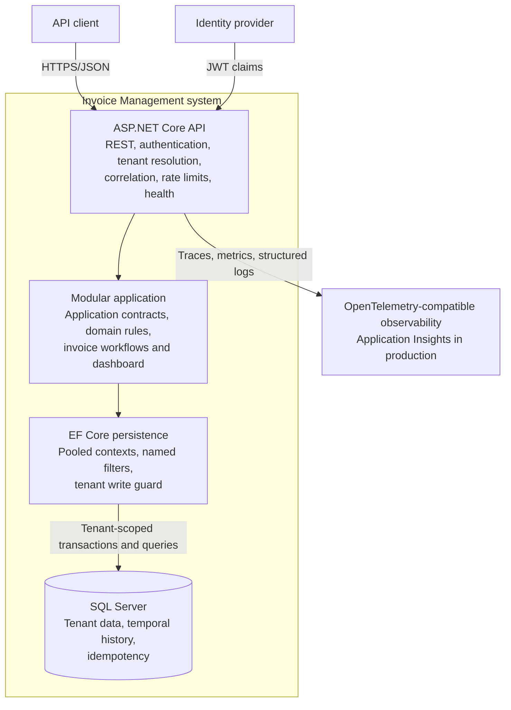

# C4 Container

```mermaid
flowchart TB
    Client["API client"]
    IdP["Identity provider"]

    subgraph Boundary["Invoice Management system"]
        Api["ASP.NET Core API<br/>REST, authentication, tenant resolution,<br/>correlation, rate limits, health"]
        Modules["Modular application<br/>Application contracts, domain rules,<br/>invoice workflows and dashboard"]
        Persistence["EF Core persistence<br/>Pooled contexts, named filters,<br/>tenant write guard"]
        Sql[("SQL Server<br/>Tenant data, temporal history,<br/>idempotency")]
    end

    Observability["OpenTelemetry-compatible observability<br/>Application Insights in production"]

    Client -->|"HTTPS/JSON"| Api
    IdP -->|"JWT claims"| Api
    Api --> Modules
    Modules --> Persistence
    Persistence -->|"Tenant-scoped transactions and queries"| Sql
    Api -->|"Traces, metrics, structured logs"| Observability
```

Redis, Service Bus, Azure Functions, AKS, and read replicas are future options and are not depicted as deployed assessment components.
