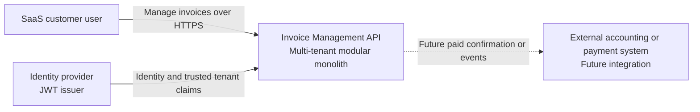

# C4 Context

The assessment implements only the API system boundary. The external accounting/payment integration explains the source of a future paid confirmation; no distributed integration is built now.
