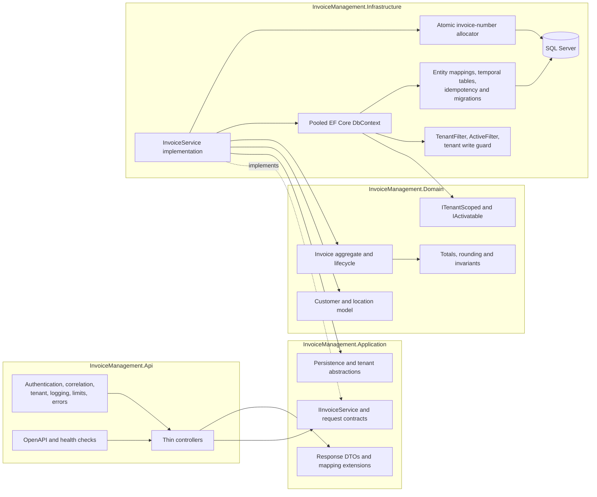

# Component Architecture

Logical module boundaries are kept inside four projects to avoid assessment-time project proliferation. Architecture tests enforce inward references and prevent Domain entities or Infrastructure implementation types from entering controller contracts.
