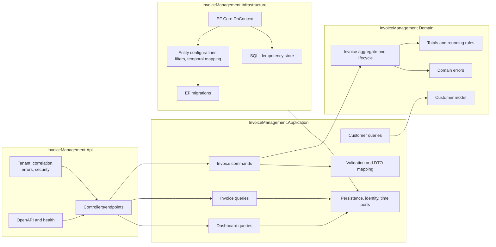

# Component Architecture

```mermaid
flowchart LR
    subgraph API["InvoiceManagement.Api"]
        Endpoints["Controllers/endpoints"]
        Middleware["Tenant, correlation,<br/>errors, security"]
        OpenApi["OpenAPI and health"]
    end

    subgraph Application["InvoiceManagement.Application"]
        CustomersApp["Customer queries"]
        InvoiceCommands["Invoice commands"]
        InvoiceQueries["Invoice queries"]
        Dashboard["Dashboard queries"]
        Validation["Validation and DTO mapping"]
        Ports["Persistence, identity, time ports"]
    end

    subgraph Domain["InvoiceManagement.Domain"]
        CustomerDomain["Customer model"]
        InvoiceAggregate["Invoice aggregate and lifecycle"]
        MoneyRules["Totals and rounding rules"]
        DomainErrors["Domain errors"]
    end

    subgraph Infrastructure["InvoiceManagement.Infrastructure"]
        DbContext["EF Core DbContext"]
        Config["Entity configurations,<br/>filters, temporal mapping"]
        Idempotency["SQL idempotency store"]
        Migrations["EF migrations"]
    end

    Endpoints --> InvoiceCommands
    Endpoints --> InvoiceQueries
    Endpoints --> Dashboard
    Middleware --> Endpoints
    OpenApi --> Endpoints
    InvoiceCommands --> InvoiceAggregate
    InvoiceCommands --> Validation
    InvoiceQueries --> Ports
    Dashboard --> Ports
    CustomersApp --> CustomerDomain
    InvoiceAggregate --> MoneyRules
    InvoiceAggregate --> DomainErrors
    Infrastructure --> Ports
    DbContext --> Config
    DbContext --> Idempotency
    Config --> Migrations
```

Logical module boundaries are kept inside four projects to avoid assessment-time project proliferation.
