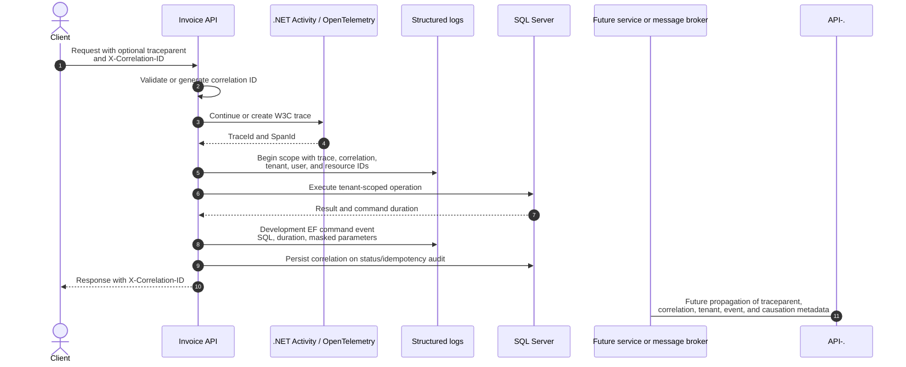

# Correlation and Trace Propagation

`CorrelationId` is a searchable operation label. W3C `TraceId` represents distributed tracing. `IdempotencyKey` protects command execution. All three have different responsibilities.
