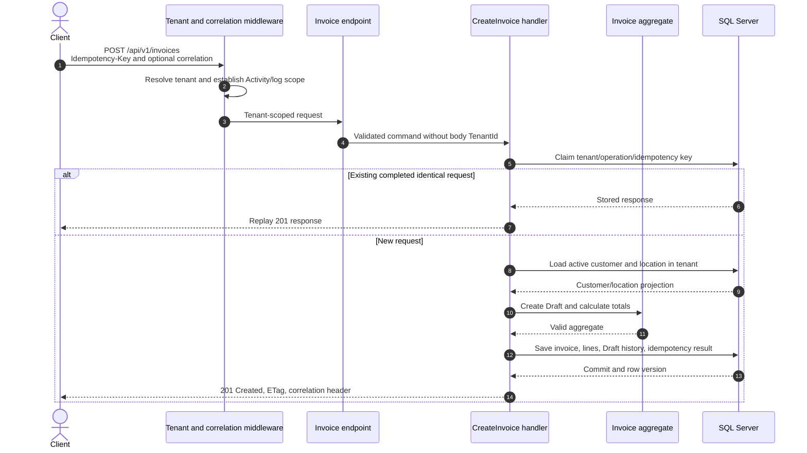

# Create Invoice Sequence

```mermaid
sequenceDiagram
    autonumber
    actor Client
    participant Middleware as Tenant and correlation middleware
    participant API as Invoice endpoint
    participant App as CreateInvoice handler
    participant Domain as Invoice aggregate
    participant DB as SQL Server

    Client->>Middleware: POST /api/v1/invoices<br/>Idempotency-Key and optional correlation
    Middleware->>Middleware: Resolve tenant and establish Activity/log scope
    Middleware->>API: Tenant-scoped request
    API->>App: Validated command without body TenantId
    App->>DB: Claim tenant/operation/idempotency key
    alt Existing completed identical request
        DB-->>App: Stored response
        App-->>Client: Replay 201 response
    else New request
        App->>DB: Load active customer and location in tenant
        DB-->>App: Customer/location projection
        App->>Domain: Create Draft and calculate totals
        Domain-->>App: Valid aggregate
        App->>DB: Save invoice, lines, Draft history, idempotency result
        DB-->>App: Commit and row version
        App-->>Client: 201 Created, ETag, correlation header
    end
```
