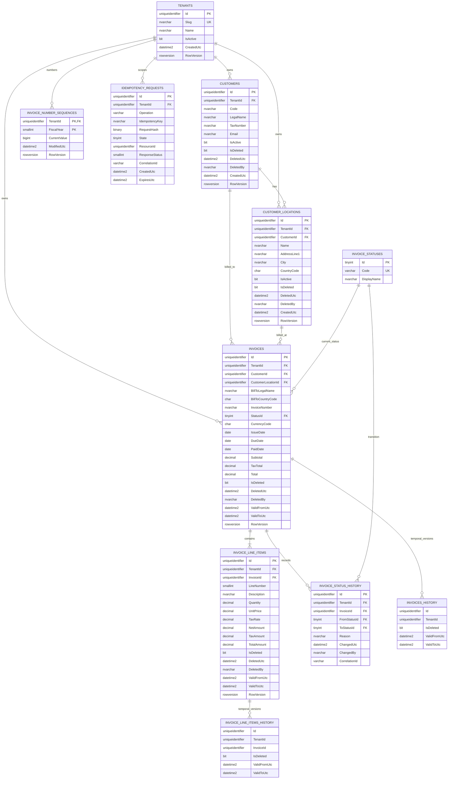

# Database ER Diagram

The ERD summarizes the most decision-relevant fields. [Database Design](../DATABASE_DESIGN.md) is authoritative for exact SQL types, nullability, audit fields, constraints, and indexes.
