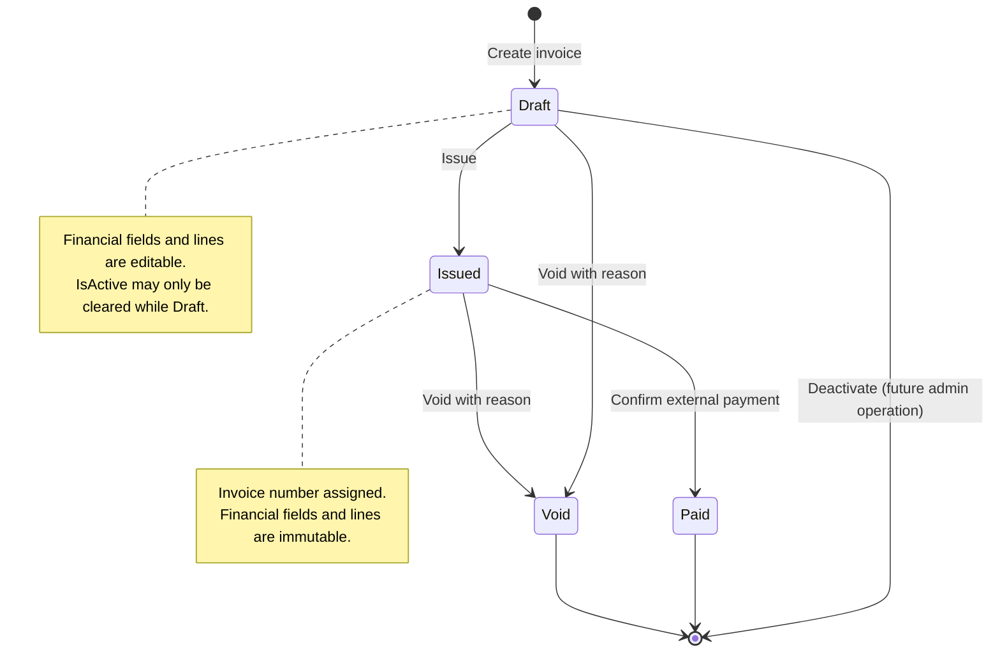

# Invoice Lifecycle

```mermaid
stateDiagram-v2
    [*] --> Draft: Create invoice
    Draft --> Issued: Issue
    Draft --> Void: Void with reason
    Draft --> [*]: Deactivate (future admin operation)
    Issued --> Paid: Confirm external payment
    Issued --> Void: Void with reason
    Paid --> [*]
    Void --> [*]

    note right of Draft
      Financial fields and lines are editable.
      IsActive may only be cleared while Draft.
    end note

    note right of Issued
      Invoice number assigned.
      Financial fields and lines are immutable.
    end note
```

The assessment does not expose the deactivation transition as an API endpoint. The state is shown to make the database policy explicit.
