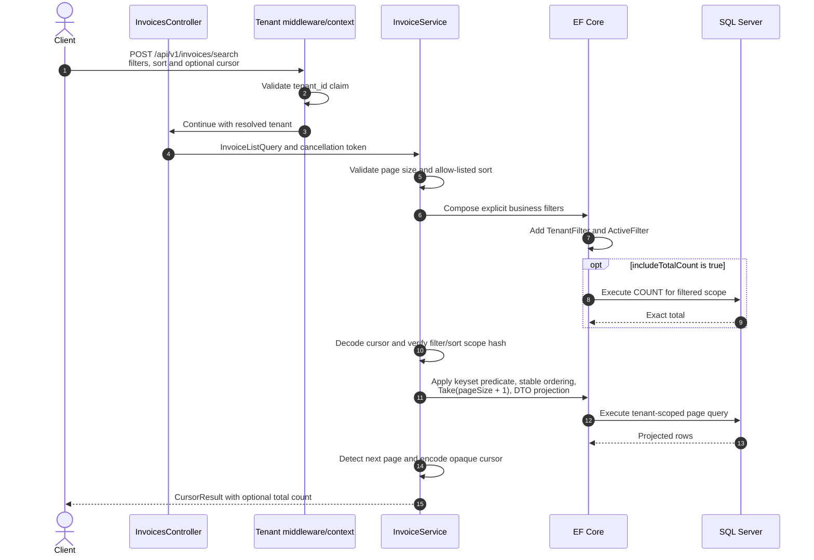

# Invoice Search Sequence

Offset pagination is not used. A future focused Specification may encapsulate reusable business predicates, but tenant isolation remains in the EF global filter and cursor/order/projection behavior remains explicit in the query workflow.
