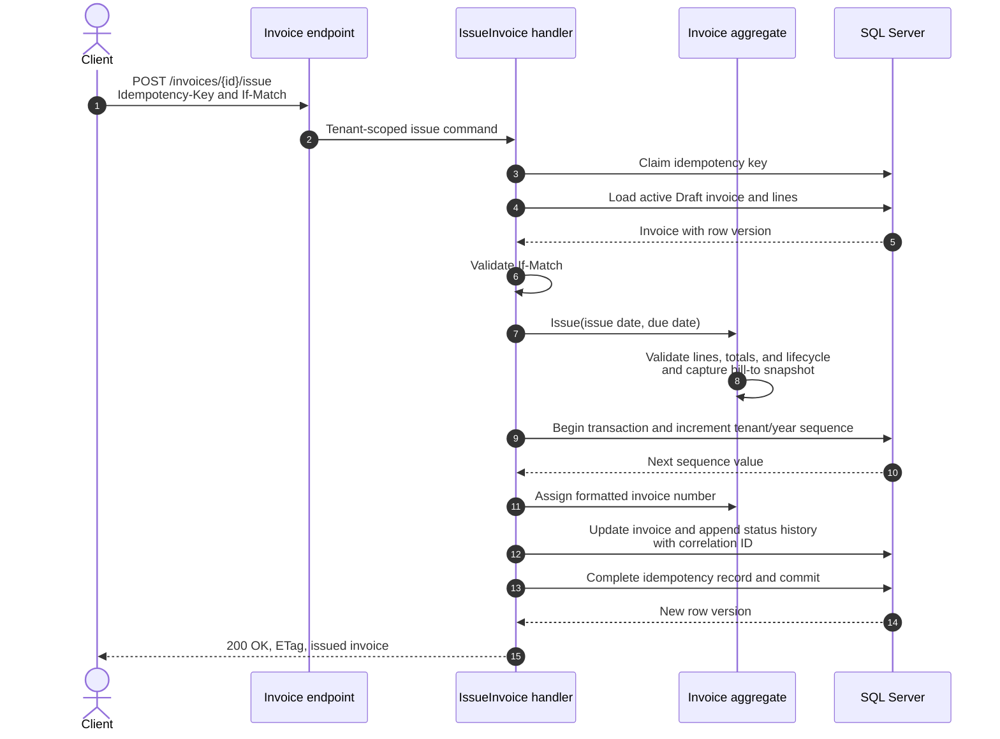

# Issue Invoice Sequence

```mermaid
sequenceDiagram
    autonumber
    actor Client
    participant API as Invoice endpoint
    participant App as IssueInvoice handler
    participant Domain as Invoice aggregate
    participant DB as SQL Server

    Client->>API: POST /invoices/{id}/issue<br/>Idempotency-Key and If-Match
    API->>App: Tenant-scoped issue command
    App->>DB: Claim idempotency key
    App->>DB: Load active Draft invoice and lines
    DB-->>App: Invoice with row version
    App->>App: Validate If-Match
    App->>Domain: Issue(issue date, due date)
    Domain->>Domain: Validate lines, totals, and lifecycle<br/>and capture bill-to snapshot
    App->>DB: Begin transaction and increment tenant/year sequence
    DB-->>App: Next sequence value
    App->>Domain: Assign formatted invoice number
    App->>DB: Update invoice and append status history<br/>with correlation ID
    App->>DB: Complete idempotency record and commit
    DB-->>App: New row version
    App-->>Client: 200 OK, ETag, issued invoice
```

The transaction and unique index prevent duplicate invoice numbers. The design does not promise gapless numbering.
