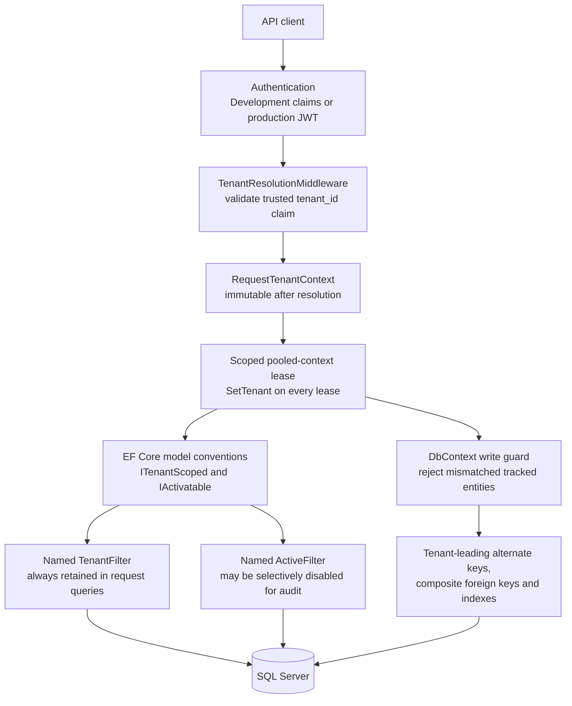

# Tenant Isolation

`CustomerId` and `CustomerLocationId` remain business/query criteria, not tenant-context substitutes. Billing location is not a global authorization scope in the implemented model. Parallel work must use a separate initialized `DbContext` per operation; a context is never shared concurrently.
